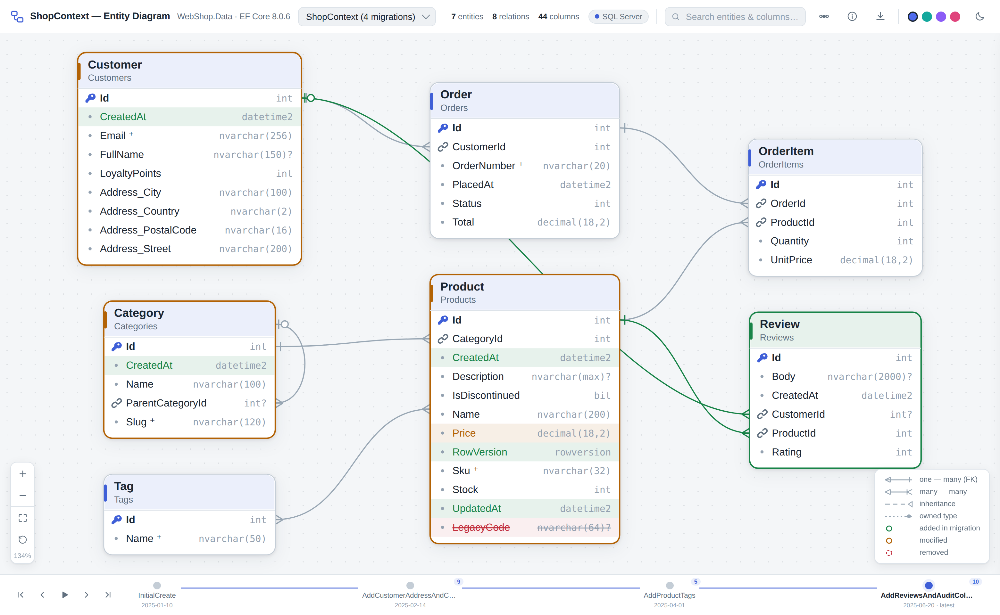
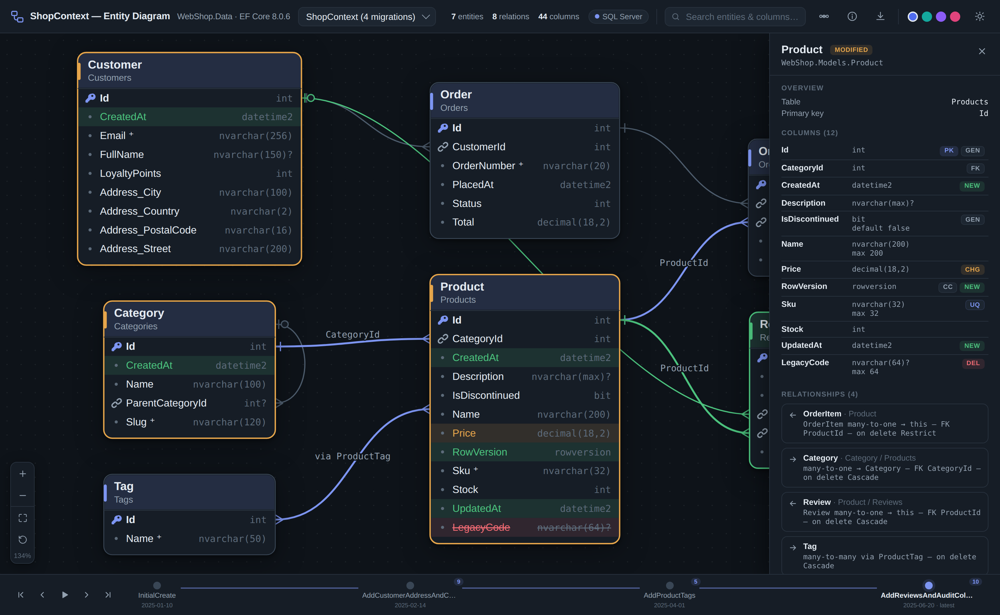
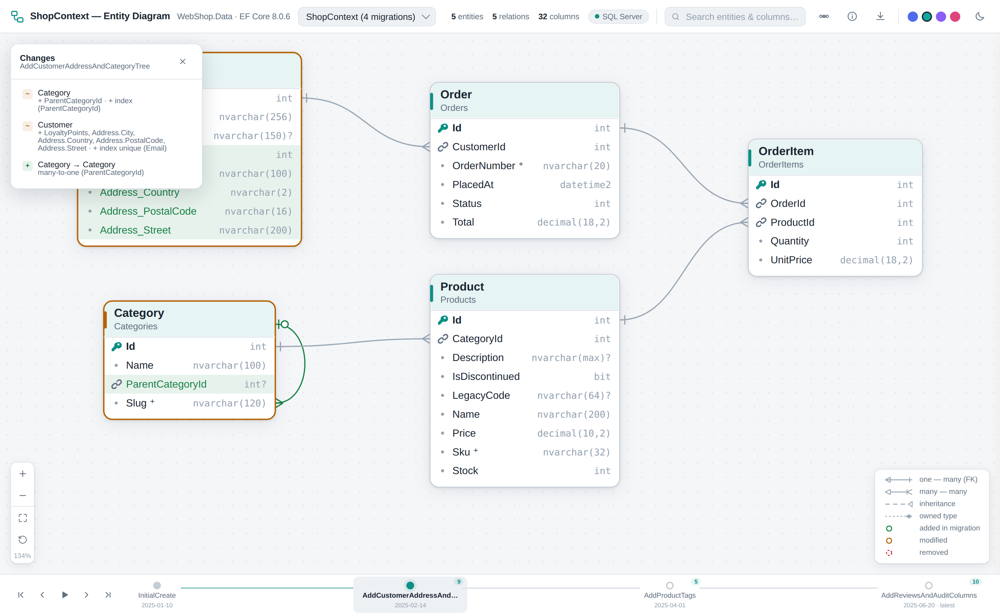
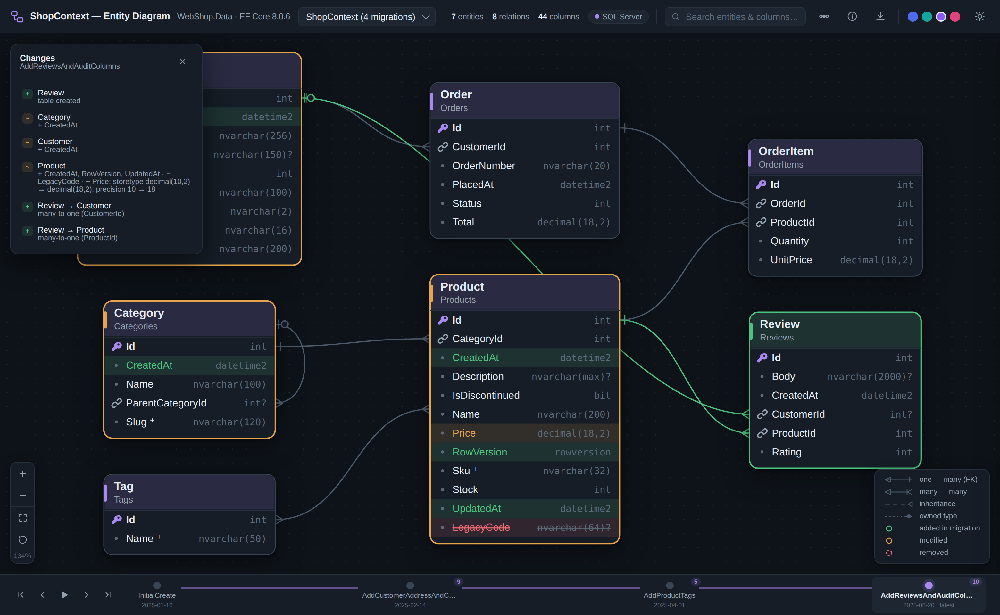

<div align="center">

# EFViz

**Zero-config interactive ER diagrams for Entity Framework Core — straight from your code.**

Point it at any workspace. It finds your `DbContext`, reads the full model and every migration,
and generates a single self-contained HTML file: a modern, interactive entity-relationship
diagram with a **migration timeline** you can scrub back and forth.

[](https://github.com/thedigitaljedi86/EFViz/actions/workflows/ci.yml)
[](https://www.nuget.org/packages/EFViz)
[](https://www.npmjs.com/package/efviz)
[](LICENSE)
[](package.json)

Available both as an **npm CLI** and a **.NET global tool** — same engine, same output.



</div>

---

## Why

Every EF Core project already contains a precise, versioned description of its database:
the model snapshot and the migration designer files. EFViz turns that into a
living diagram — no database connection, no build step, no Graphviz, no runtime reflection.
Just static analysis of the code you already have.

- 🔎 **Finds everything itself** — scans the workspace for `DbContext` classes, `DbSet<T>`
  properties, migrations, and model snapshots
- 🕰️ **Time travel** — scrub through your migrations and watch the schema evolve; every
  step highlights what was added, changed, or removed
- 📄 **One file, no server** — the output is a single HTML file that works offline,
  attaches to a PR, drops into a wiki, or deploys to any static host
- 🧭 **Enterprise-clean design** — calm colors, soft curved edges, crow's-foot notation,
  and a detail panel with everything an ER diagram should know

## Getting started

Pick whichever runtime you already have — the two front ends share one engine and produce
byte-for-byte identical diagrams (enforced by a parity check in CI).

**.NET global tool** (natural for EF Core projects — no Node required):

```bash
dotnet tool install -g EFViz
efviz-scan path/to/your/solution --open
```

**npm CLI:**

```bash
# no install needed
npx efviz path/to/your/solution

# …or install globally
npm install -g efviz
efviz-scan path/to/your/solution --open
```

Either way, open `entity-diagram.html` in a browser.

**When new migrations land**, just run the same command again — the diagram is rebuilt
from the current state of the code in milliseconds:

```bash
efviz-scan .        # refresh to the newest overview
```

> **Requirements:** either Node.js ≥ 18 **or** the .NET 8 SDK — you don't need both.
> Your project does **not** need to compile: parsing is purely static, so it works on any
> machine with the source checked out.

## Use it in a build pipeline

Don't want to install a tool on every machine and CI agent? Add EFViz to the project
itself and let your existing build produce the diagram. Two options, both **without any
global install** — a build agent only needs the .NET 8 runtime it already has:

**MSBuild package — the diagram regenerates on every `dotnet build`:**

```bash
dotnet add package EFViz.MSBuild
```

```xml
<!-- build-only reference; nothing ships into your output -->
<PackageReference Include="EFViz.MSBuild" Version="1.0.*" PrivateAssets="all" />
```

```bash
dotnet build          # → entity-diagram.html, no extra pipeline step
```

Configure via MSBuild properties, e.g. `dotnet build -p:EFVizOutput=docs/db.html`
(`EFVizOutput`, `EFVizContext`, `EFVizTitle`, `EFVizJson`, `EFVizContinueOnError`, …).
See the [package README](dotnet/EFViz.MSBuild/README.md) for the full list.

**.NET local tool — an explicit, pinned pipeline step:**

```bash
dotnet new tool-manifest          # once; commit .config/dotnet-tools.json
dotnet tool install EFViz

# in the pipeline:
dotnet tool restore
dotnet efviz-scan ./src -o docs/db-diagram.html
```

## What you get

### Interactive diagram

Pan, zoom (mouse wheel), drag entities to rearrange (positions are remembered), search
across entities and columns, and click any entity for the full story: columns with types
and constraints, primary/foreign keys, unique indexes, default values, concurrency tokens,
owned types, seed data, relationships, and the entity's own migration history.

Use the **export** button in the toolbar to save the current view as a **scalable SVG**
(vector — perfect for docs, wikis, and print) or a **2× PNG**. Both are theme-aware and
fully self-contained.

<div align="center">

</div>

### Migration timeline

The bar at the bottom is your schema's history. Step through migrations (or press play ▶)
and the diagram re-renders as it looked at that point in time — additions in green,
modifications in amber, removals in red with strike-through ghosts. A changes panel
summarizes every table, column, index, and relationship touched by the selected migration.

<div align="center">

</div>

### Themes & dark mode

Light and dark mode (follows your OS by default) with four accent themes. Preferences are
saved in the browser. Edges are soft cubic curves; relationship ends use crow's-foot
notation with optionality markers.

<div align="center">

</div>

## CLI

```text
efviz-scan [path] [options]      (alias: efviz)

  path                    Workspace root to scan (default: current directory)

  -o, --output <file>     Output HTML file           (default: entity-diagram.html)
  -c, --context <name>    Only include this DbContext (default: all found)
  -t, --title <text>      Title shown in the diagram header
      --json <file>       Also write the raw model + diff data as JSON
      --open              Open the generated diagram in your browser
  -q, --quiet             Suppress non-error output
  -v, --version           Print version
  -h, --help              Show help
```

Multiple `DbContext`s in one workspace? All of them are included — switch between them
with the dropdown in the header, or narrow with `--context`.

The `--json` output is the complete parsed model (entities, columns, relationships,
per-migration snapshots and diffs) if you want to build your own tooling on top.

## How it works

```
 workspace ──► scan ──► parse ──► diff ──► emit
              *.cs      EF Core   between   single
              files     fluent    every     HTML file
                        model     migration
```

1. **Scan** — walks the workspace (skipping `bin/`, `obj/`, `node_modules/`, …) and finds
   `DbContext` classes, `*.Designer.cs` migration files, and `*ModelSnapshot.cs` files.
2. **Parse** — every migration's `.Designer.cs` contains a complete, machine-generated
   snapshot of the model *at that migration*. EFViz parses this fluent builder
   code directly: entities, columns with store types, keys, indexes, relationships with
   delete behaviors, owned types, inheritance, and implicit many-to-many join tables.
3. **Diff** — consecutive snapshots are compared structurally, producing the added /
   modified / removed sets that power the timeline.
4. **Emit** — model + diffs are embedded as JSON in a self-contained HTML viewer
   (vanilla JS + SVG, no CDN, no tracking, works offline).

The npm CLI and the .NET tool are two independent implementations of steps 1–4 over the
**same viewer assets** (`src/viewer/`). A parity test regenerates the model with both and
asserts the JSON is identical, so switching runtimes never changes your diagram.

### No migrations? No problem

If a `DbContext` has no migrations, the model is reconstructed from your entity classes
instead: `DbSet<T>` properties, EF Core conventions (`Id` keys, `<Nav>Id` foreign keys,
DbSet-based table names), data annotations (`[Table]`, `[Key]`, `[Required]`,
`[MaxLength]`, `[ForeignKey]`, `[Owned]`, `[Timestamp]`, …), and navigation properties.
Custom fluent configuration in `OnModelCreating` is not evaluated in this mode, so the
first migration you add will make the diagram exact.

### Not using EF Core? Point it at a SQLite file

EFViz's viewer is ORM-agnostic — only the parser is EF-specific. The **npm CLI** can also
read a **SQLite database directly**, which makes it useful for any stack that stores its
schema in SQLite (better-sqlite3, `node:sqlite`, Drizzle, raw SQL, a Next.js app, …):

```bash
npx efviz ./data/app.sqlite -o schema.html --open
```

Give it a `.sqlite`/`.db`/`.sqlite3` file (or add `--sqlite`) and it reads the schema
straight from the database — tables, views, columns and types, primary keys, foreign keys
**with their on-delete behaviour**, unique indexes, self-references, and many-to-many join
tables — via `sqlite_master` and PRAGMAs. Nothing is guessed from code.

```bash
# try it on a generated micro-bakery database
node examples/microbakery-sqlite/seed.mjs
npx efviz microbakery.sqlite -o microbakery.html --open
```

> SQLite mode uses Node's built-in `node:sqlite`, so it needs **Node ≥ 22.5** (EF Core
> scanning works on Node ≥ 18). There's no migration history in a raw database, so you get
> a single current-schema view rather than the migration timeline. It's an npm-CLI feature;
> the .NET tool stays focused on EF Core.

## Try it

The repository ships with a sample project — a small web shop with four migrations that
add owned types, a self-referencing category tree, many-to-many product tags, audit
columns, and a dropped legacy column:

```bash
git clone https://github.com/thedigitaljedi86/EFViz.git
cd EFViz

# with Node
node bin/efviz.js examples/WebShop -o webshop.html --open

# …or with .NET
dotnet run --project dotnet/EFViz -- examples/WebShop -o webshop.html --open
```

Or just open [`docs/demo/webshop.html`](docs/demo/webshop.html) from a checkout.

## Feature support

| EF Core feature | Support |
| --- | --- |
| Entities, columns, store types, nullability | ✅ from migrations & source |
| Primary / alternate / composite keys | ✅ |
| Foreign keys, delete behaviors, required/optional | ✅ |
| One-to-one, one-to-many | ✅ |
| Many-to-many (implicit join entity) | ✅ detected & collapsible |
| Owned types (table splitting & separate tables) | ✅ |
| Indexes (unique, filtered) | ✅ |
| Default values / SQL, computed columns | ✅ |
| Identity / value generation, concurrency tokens | ✅ |
| TPH inheritance & discriminators | ✅ basic |
| Seed data (`HasData`) | ✅ counted |
| Providers | SQL Server, PostgreSQL, SQLite, MySQL, Oracle detected |
| Views (`ToView`) | ✅ flagged |

## Keyboard shortcuts

| Key | Action |
| --- | --- |
| `←` / `→` | Previous / next migration |
| `Space` | Play through migrations |
| `+` / `-` | Zoom in / out |
| `F` | Fit diagram to view |
| `R` | Reset layout |
| `/` | Focus search |
| `Esc` | Close panel / clear |

## Contributing

Issues and PRs are very welcome. The codebase is small and dependency-free:

```
bin/efviz.js       npm CLI
src/scan.js                      workspace discovery
src/csharp.js                    minimal C# lexing helpers
src/snapshotParser.js            migration Designer / ModelSnapshot parser
src/sourceParser.js              convention-based fallback (no migrations)
src/diff.js                      model-to-model structural diff
src/emit.js + src/viewer/        the interactive HTML viewer (shared by both tools)
test/                            node:test suites

dotnet/EFViz/        the .NET global tool — a C# port of the same
                                 scan → parse → diff → emit pipeline, embedding
                                 the shared src/viewer/ assets
dotnet/EFViz.Tests/  xunit suites, incl. a JSON parity test that
                                 asserts identical output to the Node reference
```

```bash
node --test                         # run the Node tests
npm run demo                        # rebuild docs/demo/webshop.html

dotnet test dotnet/EFViz.sln   # run the .NET tests (+ parity check)
```

When you change a parser, keep the two implementations in step: the parity test in
`dotnet/EFViz.Tests` will fail if the .NET output drifts from the Node
reference fixture (regenerate it with `node bin/efviz.js examples/WebShop
--json dotnet/EFViz.Tests/fixtures/webshop.node.json`).

See [CONTRIBUTING.md](CONTRIBUTING.md) for details.

## License

[MIT](LICENSE)
